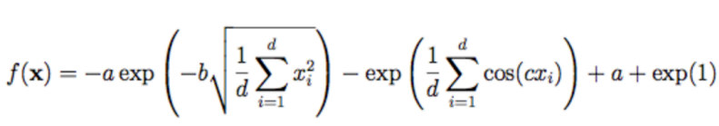
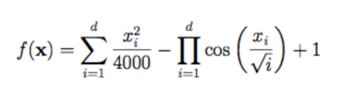
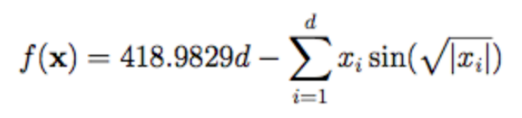
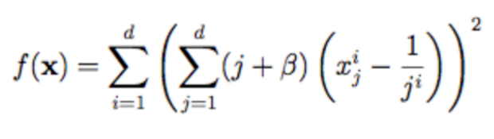
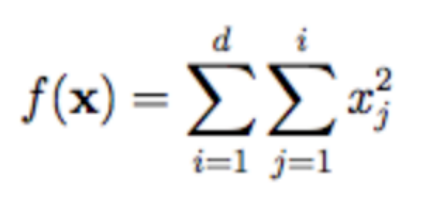
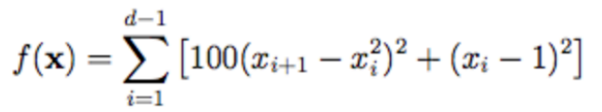
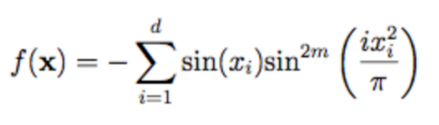
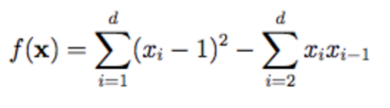
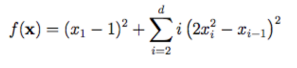

# PRÁCTICA 1

## Introducción

En este proyecto realizamos la implementación de funciones de regresión lineal:

### Ackley

### Griewank

### Rastringin

### Schewefel

### Perm

### Rotated Hype-Ellipsoid

### Rosenbrock

### Michalewicz

### Trid

### Dixon-price

*Implementación disponible en: _'src/main/java/uja/meta/funciones'_

Además son implementados los algoritmos de Búsqueda local del mejor y búsqueda con conceptos tabú.   

*Implementación disponible en: _'src/main/java/uja/meta/algoritmos'_

A continuación trataremos los elementos del desarrollo más destacados del proyecto:

## Config Files

En la ruta _'src/main/resources/configFiles'_ tendremos la configuración para cada función
anteriormente mencionada. Se leerá desde la clase _'Lector.java'_ y servirá para crear nuestros entornos.

## Logs

Los logs generados se encuentran en _'src/main/resources/logs'_ existiendo un directorio para cada función 
y dentro los logs para cada algoritmo. La configuración se encuentra en _'src/main/resources/log4j.properties'_.

## Concurrencia

Debido al número de repetición de ejecuciones similares, aplicamos concurrencia para 
así conseguir un mayor rendimiento y velocidad de ejecución sin alterar los resultados finales. 
Nos ayudamos de _java.util.concurrent_.

## CSV

Para facilitar la escritura en tablas adaptadas, realizamos un proceso previo de conversión de 
los archivos a .csv, obteniendo de esta forma unos datos mucho más fáciles de leer y manejar posteriormente. 
Podemos encontrar los archivos generados en el directorio _csv_.

### Fin
_Para obtener información de ejecución y pruebas, leer el MANUAL.md en la ráiz de este documento._